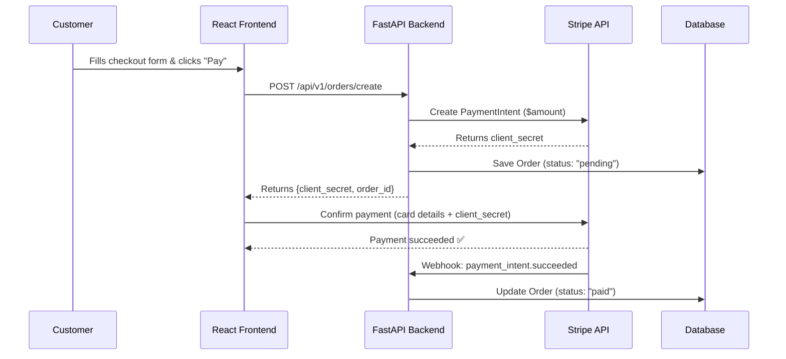
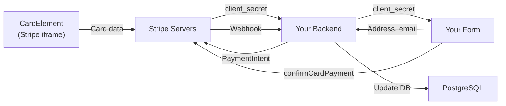
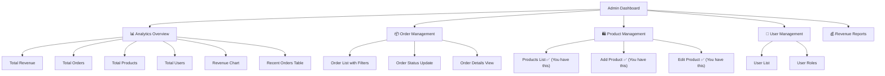

# 💳 Payment Integration & 📊 Admin Dashboard Guide

> A complete guide tailored to your e-commerce app:
>
> - **Frontend:** React + Vite + Tailwind CSS
> - **Backend:** FastAPI + SQLAlchemy + PostgreSQL

---

## Table of Contents

1. [Payment Integration — The Big Picture](#1-payment-integration--the-big-picture)
2. [Step-by-Step: Stripe Payment Integration](#2-step-by-step-stripe-payment-integration)
3. [Admin Dashboard — Design & Architecture](#3-admin-dashboard--design--architecture)
4. [Step-by-Step: Building the Admin Dashboard](#4-step-by-step-building-the-admin-dashboard)

---

## 1. Payment Integration — The Big Picture

### What You Currently Have

Your [CheckoutPage.jsx](file:///d:/clone/E-commerse-web-app/frontend/src/pages/CheckoutPage.jsx) currently **simulates** a payment with a `setTimeout`:

```javascript
// Line 17-24 — This is a FAKE payment
const handlePlaceOrder = (e) => {
  e.preventDefault();
  setTimeout(() => {
    setIsSuccess(true);
    clearCart();
  }, 1500);
};
```

This means:

- ❌ No real money is charged
- ❌ No order is saved to the database
- ❌ No payment validation happens
- ❌ Card details are collected but never sent anywhere

### What You Need



> [!IMPORTANT]
> **Never send raw card numbers to YOUR server.** Stripe's `<CardElement>` handles card data directly with Stripe's servers. Your backend only receives a `client_secret` token — never the actual card number. This keeps you **PCI-compliant**.

### Why Stripe?

| Feature              | Stripe           | PayPal       | Razorpay      |
| -------------------- | ---------------- | ------------ | ------------- |
| Best for             | International    | PayPal users | India-focused |
| Card support         | ✅ All major     | ✅ Limited   | ✅ All major  |
| UPI / Local methods  | Via integrations | ❌           | ✅ Built-in   |
| Developer Experience | ⭐⭐⭐⭐⭐       | ⭐⭐⭐       | ⭐⭐⭐⭐      |
| Test mode            | ✅ Excellent     | ✅ Sandbox   | ✅ Good       |
| Webhooks             | ✅ Rich          | ✅ Basic     | ✅ Good       |

> [!TIP]
> If your target audience is in **Sri Lanka/India**, consider **Razorpay** or **PayHere** instead. The architecture is almost identical — only the SDK and API calls change.

---

## 2. Step-by-Step: Stripe Payment Integration

### Phase 1: Backend — New Models & API

#### Step 1.1: Create the `Order` Model

You need a new database model to persist orders. This goes alongside your existing [product.py](file:///d:/clone/E-commerse-web-app/backend/app/models/product.py) and [user.py](file:///d:/clone/E-commerse-web-app/backend/app/models/user.py).

**New file:** `backend/app/models/order.py`

```python
from sqlalchemy import Integer, String, Float, DateTime, ForeignKey, JSON
from sqlalchemy.orm import Mapped, mapped_column, relationship
from sqlalchemy.sql import func

from app.db.base import Base


class Order(Base):
    __tablename__ = "orders"

    id: Mapped[int] = mapped_column(Integer, primary_key=True, index=True)
    user_id: Mapped[int] = mapped_column(Integer, ForeignKey("users.id"), nullable=False)

    # Payment info
    stripe_payment_intent_id: Mapped[str | None] = mapped_column(String(255), unique=True, nullable=True)
    payment_method: Mapped[str] = mapped_column(String(50), nullable=False)  # "card", "paypal", "cod"
    payment_status: Mapped[str] = mapped_column(String(50), default="pending")  # "pending", "paid", "failed", "refunded"

    # Order info
    status: Mapped[str] = mapped_column(String(50), default="pending")  # "pending", "confirmed", "shipped", "delivered", "cancelled"
    total_amount: Mapped[float] = mapped_column(Float, nullable=False)
    shipping_cost: Mapped[float] = mapped_column(Float, default=0.0)
    tax_amount: Mapped[float] = mapped_column(Float, default=0.0)

    # Shipping address (stored as JSON)
    shipping_address: Mapped[dict | None] = mapped_column(JSON, nullable=True)

    # Contact
    email: Mapped[str] = mapped_column(String(255), nullable=False)
    phone: Mapped[str | None] = mapped_column(String(50), nullable=False)

    # Items snapshot (JSON array of {product_id, name, price, quantity, image})
    items: Mapped[list | None] = mapped_column(JSON, nullable=True)

    created_at: Mapped[DateTime] = mapped_column(DateTime(timezone=True), server_default=func.now())
    updated_at: Mapped[DateTime] = mapped_column(DateTime(timezone=True), server_default=func.now(), onupdate=func.now())

    # Relationship (optional, for querying)
    # user = relationship("User", back_populates="orders")
```

> [!NOTE]
> **Why store `items` as JSON?** Products can change price/name later, but the order snapshot must reflect what the customer actually paid. This is a common e-commerce pattern called **denormalization for historical accuracy**.

#### Step 1.2: Register the Model

Update [\_\_init\_\_.py](file:///d:/clone/E-commerse-web-app/backend/app/models/__init__.py):

```diff
 from app.models.product import Product
 from app.models.user import User
 from app.models.category import Category
 from app.models.review import Review
 from app.models.product_embedding import ProductEmbedding
+from app.models.order import Order

-__all__ = ["Product", "User", "Category", "Review", "ProductEmbedding"]
+__all__ = ["Product", "User", "Category", "Review", "ProductEmbedding", "Order"]
```

#### Step 1.3: Create Order Schemas

**New file:** `backend/app/schemas/order.py`

```python
from pydantic import BaseModel
from typing import Optional
from datetime import datetime


class OrderItemSchema(BaseModel):
    product_id: int
    name: str
    price: float
    quantity: int
    image: Optional[str] = None


class ShippingAddressSchema(BaseModel):
    first_name: str
    last_name: str
    street: str
    city: str
    state: str
    zip_code: str


class CreateOrderRequest(BaseModel):
    email: str
    phone: Optional[str] = None
    payment_method: str  # "card", "paypal", "cod"
    shipping_address: ShippingAddressSchema
    items: list[OrderItemSchema]
    shipping_cost: float = 15.0
    tax_amount: float = 0.0


class OrderResponse(BaseModel):
    id: int
    status: str
    payment_status: str
    payment_method: str
    total_amount: float
    shipping_cost: float
    tax_amount: float
    items: list
    shipping_address: dict
    email: str
    created_at: datetime
    client_secret: Optional[str] = None  # Only for card payments

    class Config:
        from_attributes = True
```

#### Step 1.4: Create the Orders API Endpoint

**New file:** `backend/app/api/v1/endpoints/orders.py`

```python
import stripe
from fastapi import APIRouter, Depends, HTTPException
from sqlalchemy.orm import Session

from app.db.session import get_db
from app.models.order import Order
from app.schemas.order import CreateOrderRequest, OrderResponse
from app.core.config import settings  # You'll need to add STRIPE_SECRET_KEY here

router = APIRouter()

# Initialize Stripe
stripe.api_key = settings.STRIPE_SECRET_KEY


@router.post("/", response_model=OrderResponse)
async def create_order(
    order_data: CreateOrderRequest,
    db: Session = Depends(get_db),
    # current_user = Depends(get_current_user)  # Add auth dependency
):
    """Create a new order and (if card payment) create a Stripe PaymentIntent."""

    # 1. Calculate total
    subtotal = sum(item.price * item.quantity for item in order_data.items)
    total = subtotal + order_data.shipping_cost + order_data.tax_amount

    # 2. Create the order in database
    new_order = Order(
        user_id=1,  # Replace with current_user.id
        email=order_data.email,
        phone=order_data.phone,
        payment_method=order_data.payment_method,
        payment_status="pending",
        status="pending",
        total_amount=total,
        shipping_cost=order_data.shipping_cost,
        tax_amount=order_data.tax_amount,
        shipping_address=order_data.shipping_address.model_dump(),
        items=[item.model_dump() for item in order_data.items],
    )

    client_secret = None

    # 3. If paying by card, create Stripe PaymentIntent
    if order_data.payment_method == "card":
        try:
            intent = stripe.PaymentIntent.create(
                amount=int(total * 100),  # Stripe uses cents
                currency="usd",
                metadata={"order_id": str(new_order.id) if new_order.id else "pending"},
            )
            new_order.stripe_payment_intent_id = intent.id
            client_secret = intent.client_secret
        except stripe.error.StripeError as e:
            raise HTTPException(status_code=400, detail=str(e))

    # 4. For COD, mark as confirmed immediately
    if order_data.payment_method == "cod":
        new_order.status = "confirmed"

    db.add(new_order)
    db.commit()
    db.refresh(new_order)

    # 5. Return order with client_secret (for card payments)
    response = OrderResponse.model_validate(new_order)
    response.client_secret = client_secret
    return response


@router.get("/", response_model=list[OrderResponse])
async def get_all_orders(
    db: Session = Depends(get_db),
    # admin_user = Depends(get_admin_user)  # Admin only
):
    """Get all orders (admin endpoint)."""
    orders = db.query(Order).order_by(Order.created_at.desc()).all()
    return orders


@router.get("/{order_id}", response_model=OrderResponse)
async def get_order(order_id: int, db: Session = Depends(get_db)):
    """Get a specific order by ID."""
    order = db.query(Order).filter(Order.id == order_id).first()
    if not order:
        raise HTTPException(status_code=404, detail="Order not found")
    return order


@router.patch("/{order_id}/status")
async def update_order_status(
    order_id: int,
    status: str,
    db: Session = Depends(get_db),
):
    """Update order status (admin endpoint)."""
    order = db.query(Order).filter(Order.id == order_id).first()
    if not order:
        raise HTTPException(status_code=404, detail="Order not found")

    order.status = status
    db.commit()
    return {"message": f"Order #{order_id} status updated to '{status}'"}
```

#### Step 1.5: Stripe Webhook Endpoint

**New file:** `backend/app/api/v1/endpoints/webhooks.py`

```python
import stripe
from fastapi import APIRouter, Request, HTTPException
from sqlalchemy.orm import Session
from app.db.session import get_db
from app.models.order import Order
from app.core.config import settings

router = APIRouter()


@router.post("/stripe")
async def stripe_webhook(request: Request, db: Session = next(get_db())):
    """
    Stripe sends this webhook AFTER a payment succeeds or fails.
    This is the ONLY reliable way to confirm payment.
    """
    payload = await request.body()
    sig_header = request.headers.get("stripe-signature")

    try:
        event = stripe.Webhook.construct_event(
            payload, sig_header, settings.STRIPE_WEBHOOK_SECRET
        )
    except ValueError:
        raise HTTPException(status_code=400, detail="Invalid payload")
    except stripe.error.SignatureVerificationError:
        raise HTTPException(status_code=400, detail="Invalid signature")

    # Handle the event
    if event["type"] == "payment_intent.succeeded":
        intent = event["data"]["object"]
        # Find and update the order
        order = db.query(Order).filter(
            Order.stripe_payment_intent_id == intent["id"]
        ).first()
        if order:
            order.payment_status = "paid"
            order.status = "confirmed"
            db.commit()

    elif event["type"] == "payment_intent.payment_failed":
        intent = event["data"]["object"]
        order = db.query(Order).filter(
            Order.stripe_payment_intent_id == intent["id"]
        ).first()
        if order:
            order.payment_status = "failed"
            db.commit()

    return {"status": "ok"}
```

> [!CAUTION]
> **Webhooks are critical!** Never rely solely on the frontend `onSuccess` callback to mark orders as paid. A user could close their browser mid-payment. The webhook is Stripe's server-to-server guarantee that payment actually went through.

---

### Phase 2: Frontend — Stripe Elements Integration

#### Step 2.1: Install Stripe

```bash
cd frontend
npm install @stripe/react-stripe-js @stripe/stripe-js
```

#### Step 2.2: Add Order API Functions

Add these to your existing [api.js](file:///d:/clone/E-commerse-web-app/frontend/src/services/api.js):

```javascript
// Orders
createOrder: async (orderData, token) => {
  return request(`${API_BASE}/orders`, {
    method: 'POST',
    headers: withAuthHeaders({ 'Content-Type': 'application/json' }, token),
    body: JSON.stringify(orderData),
  });
},

getOrders: async (token) => {
  return request(`${API_BASE}/orders`, {
    headers: withAuthHeaders({}, token),
  });
},

getOrder: async (id, token) => {
  return request(`${API_BASE}/orders/${id}`, {
    headers: withAuthHeaders({}, token),
  });
},

updateOrderStatus: async (id, status, token) => {
  return request(`${API_BASE}/orders/${id}/status?status=${status}`, {
    method: 'PATCH',
    headers: withAuthHeaders({}, token),
  });
},
```

#### Step 2.3: Rewrite the Checkout Page

Here's how your [CheckoutPage.jsx](file:///d:/clone/E-commerse-web-app/frontend/src/pages/CheckoutPage.jsx) `handlePlaceOrder` should work with real Stripe:

```jsx
import { loadStripe } from "@stripe/stripe-js";
import {
  Elements,
  CardElement,
  useStripe,
  useElements,
} from "@stripe/react-stripe-js";

// Load Stripe outside of component (only once)
const stripePromise = loadStripe("pk_test_YOUR_PUBLISHABLE_KEY");

const CheckoutForm = () => {
  const stripe = useStripe();
  const elements = useElements();
  const { cartItems, cartTotal, clearCart } = useCart();
  const [isProcessing, setIsProcessing] = useState(false);
  const [error, setError] = useState(null);

  const handlePlaceOrder = async (e) => {
    e.preventDefault();
    setIsProcessing(true);
    setError(null);

    // STEP 1: Send order to YOUR backend
    const orderData = {
      email: formData.email,
      phone: formData.phone,
      payment_method: paymentMethod,
      shipping_address: {
        first_name: formData.firstName,
        last_name: formData.lastName,
        street: formData.street,
        city: formData.city,
        state: formData.state,
        zip_code: formData.zipCode,
      },
      items: cartItems.map((item) => ({
        product_id: item.id,
        name: item.name,
        price: item.price,
        quantity: item.quantity,
        image: item.images?.[0] || null,
      })),
      shipping_cost: shipping,
      tax_amount: tax,
    };

    try {
      // Your backend creates a Stripe PaymentIntent and returns client_secret
      const order = await api.createOrder(orderData, token);

      if (paymentMethod === "card") {
        // STEP 2: Confirm the payment with Stripe directly
        const { error: stripeError, paymentIntent } =
          await stripe.confirmCardPayment(order.client_secret, {
            payment_method: {
              card: elements.getElement(CardElement),
              billing_details: { email: formData.email },
            },
          });

        if (stripeError) {
          setError(stripeError.message);
          setIsProcessing(false);
          return;
        }

        if (paymentIntent.status === "succeeded") {
          setIsSuccess(true);
          clearCart();
        }
      } else if (paymentMethod === "cod") {
        // COD — order is already confirmed by backend
        setIsSuccess(true);
        clearCart();
      }
    } catch (err) {
      setError(err.message);
    }

    setIsProcessing(false);
  };

  return (
    <form onSubmit={handlePlaceOrder}>
      {/* ... your existing form fields ... */}

      {/* Replace your manual card inputs with Stripe's secure CardElement */}
      {paymentMethod === "card" && (
        <div className="p-4 border border-gray-200 rounded-xl bg-gray-50">
          <CardElement
            options={{
              style: {
                base: {
                  fontSize: "16px",
                  color: "#1f2937",
                  "::placeholder": { color: "#9ca3af" },
                },
              },
            }}
          />
        </div>
      )}

      {error && <p className="text-red-500 text-sm mt-2">{error}</p>}

      <button type="submit" disabled={isProcessing || !stripe}>
        {isProcessing ? "Processing..." : "Place Order"}
      </button>
    </form>
  );
};

// Wrap with Stripe Elements provider
const CheckoutPage = () => (
  <Elements stripe={stripePromise}>
    <CheckoutForm />
  </Elements>
);
```

> [!IMPORTANT]
> **Key security point:** Notice that `<CardElement>` replaces your manual card number inputs. With `<CardElement>`, the card data goes **directly to Stripe's servers** via an iframe — it never touches your server. This is what makes you PCI-compliant.

#### How the Data Flows



---

### Phase 3: Environment Variables

Add to your `backend/.env`:

```
STRIPE_SECRET_KEY=sk_test_xxxxxxxxxxxx
STRIPE_PUBLISHABLE_KEY=pk_test_xxxxxxxxxxxx
STRIPE_WEBHOOK_SECRET=whsec_xxxxxxxxxxxx
```

> [!TIP]
> **For testing**, use Stripe's test card: `4242 4242 4242 4242` with any future expiry date and any 3-digit CVC.

---

## 3. Admin Dashboard — Design & Architecture

### What You Currently Have

Your [AdminDashboard.jsx](file:///d:/clone/E-commerse-web-app/frontend/src/admin/pages/AdminDashboard.jsx) is a placeholder with **hardcoded values**:

```jsx
// Hardcoded static data — not connected to real data
<p className="text-3xl font-bold mt-2">$24,500</p>  // Fake
<p className="text-3xl font-bold mt-2">1,240</p>     // Fake
<p className="text-3xl font-bold mt-2">120</p>        // Fake
```

Your [AdminLayout.jsx](file:///d:/clone/E-commerse-web-app/frontend/src/layouts/AdminLayout.jsx) sidebar only has 3 links: Dashboard, Products, Add Product.

### What a Complete Admin Dashboard Needs



---

## 4. Step-by-Step: Building the Admin Dashboard

### Dashboard Layout Design

Here's how a professional admin dashboard should be structured visually:

```
┌──────────────────────────────────────────────────────────────┐
│  SIDEBAR (w-64)           │  TOPBAR (h-16)                  │
│  ┌─────────────────────┐  │  Search... │ Notifications │ 👤 │
│  │ 🛒 ShopAdmin        │  ├──────────────────────────────────┤
│  ├─────────────────────┤  │                                  │
│  │ 📊 Dashboard        │  │  ┌─────┐ ┌─────┐ ┌─────┐ ┌────┐│
│  │ 📦 Orders      NEW  │  │  │Rev. │ │Ord. │ │Prod.│ │User││
│  │ 🛍️ Products         │  │  │$24k │ │340  │ │120  │ │85  ││
│  │ ➕ Add Product       │  │  └─────┘ └─────┘ └─────┘ └────┘│
│  │ 👥 Customers        │  │                                  │
│  │ 📈 Analytics        │  │  ┌──────────────┐ ┌────────────┐│
│  ├─────────────────────┤  │  │ Revenue Chart │ │ Orders by  ││
│  │ ⚙️ Settings         │  │  │  📈 Line      │ │ Status 🍩 ││
│  │ 🚪 Logout           │  │  └──────────────┘ └────────────┘│
│  └─────────────────────┘  │                                  │
│                           │  ┌───────────────────────────────┤
│                           │  │ Recent Orders Table           │
│                           │  │ #1234 │ John │ $125 │ Shipped │
│                           │  │ #1233 │ Jane │ $89  │ Pending │
│                           │  └───────────────────────────────┘
└──────────────────────────────────────────────────────────────┘
```

### Step 4.1: Backend — Dashboard Stats API

**New file:** `backend/app/api/v1/endpoints/dashboard.py`

```python
from fastapi import APIRouter, Depends
from sqlalchemy.orm import Session
from sqlalchemy import func

from app.db.session import get_db
from app.models.order import Order
from app.models.product import Product
from app.models.user import User

router = APIRouter()


@router.get("/stats")
async def get_dashboard_stats(db: Session = Depends(get_db)):
    """Get overview stats for the admin dashboard."""

    total_revenue = db.query(func.sum(Order.total_amount)).filter(
        Order.payment_status == "paid"
    ).scalar() or 0

    total_orders = db.query(func.count(Order.id)).scalar() or 0
    total_products = db.query(func.count(Product.id)).scalar() or 0
    total_users = db.query(func.count(User.id)).scalar() or 0

    # Orders by status
    pending_orders = db.query(func.count(Order.id)).filter(Order.status == "pending").scalar() or 0
    shipped_orders = db.query(func.count(Order.id)).filter(Order.status == "shipped").scalar() or 0
    delivered_orders = db.query(func.count(Order.id)).filter(Order.status == "delivered").scalar() or 0

    # Recent orders
    recent_orders = db.query(Order).order_by(Order.created_at.desc()).limit(10).all()

    return {
        "total_revenue": total_revenue,
        "total_orders": total_orders,
        "total_products": total_products,
        "total_users": total_users,
        "orders_by_status": {
            "pending": pending_orders,
            "shipped": shipped_orders,
            "delivered": delivered_orders,
        },
        "recent_orders": [
            {
                "id": o.id,
                "email": o.email,
                "total_amount": o.total_amount,
                "status": o.status,
                "payment_status": o.payment_status,
                "created_at": o.created_at.isoformat(),
            }
            for o in recent_orders
        ],
    }
```

### Step 4.2: Add APIs to Frontend Service

Add to [api.js](file:///d:/clone/E-commerse-web-app/frontend/src/services/api.js):

```javascript
// Dashboard (Admin)
getDashboardStats: async (token) => {
  return request(`${API_BASE}/dashboard/stats`, {
    headers: withAuthHeaders({}, token),
  });
},
```

### Step 4.3: Enhanced Admin Dashboard Component

Here's the full replacement for your [AdminDashboard.jsx](file:///d:/clone/E-commerse-web-app/frontend/src/admin/pages/AdminDashboard.jsx):

```jsx
import React, { useState, useEffect } from "react";
import {
  FiDollarSign,
  FiShoppingBag,
  FiBox,
  FiUsers,
  FiTrendingUp,
  FiClock,
  FiCheck,
  FiTruck,
} from "react-icons/fi";
import { api } from "../../services/api";
import { useAuth } from "../../services/AuthContext";

const AdminDashboard = () => {
  const { token } = useAuth();
  const [stats, setStats] = useState(null);
  const [loading, setLoading] = useState(true);

  useEffect(() => {
    const fetchStats = async () => {
      try {
        const data = await api.getDashboardStats(token);
        setStats(data);
      } catch (error) {
        console.error("Failed to fetch stats:", error);
      } finally {
        setLoading(false);
      }
    };
    fetchStats();
  }, [token]);

  if (loading) {
    return (
      <div className="flex items-center justify-center h-64">
        <div className="w-8 h-8 border-4 border-blue-500 border-t-transparent rounded-full animate-spin" />
      </div>
    );
  }

  const statCards = [
    {
      title: "Total Revenue",
      value: `$${(stats?.total_revenue || 0).toLocaleString()}`,
      icon: FiDollarSign,
      color: "from-green-500 to-emerald-600",
      change: "+12.5%",
    },
    {
      title: "Total Orders",
      value: stats?.total_orders?.toLocaleString() || "0",
      icon: FiShoppingBag,
      color: "from-blue-500 to-indigo-600",
      change: "+8.2%",
    },
    {
      title: "Products",
      value: stats?.total_products?.toLocaleString() || "0",
      icon: FiBox,
      color: "from-orange-500 to-amber-600",
      change: "+3.1%",
    },
    {
      title: "Customers",
      value: stats?.total_users?.toLocaleString() || "0",
      icon: FiUsers,
      color: "from-purple-500 to-violet-600",
      change: "+15.3%",
    },
  ];

  const getStatusBadge = (status) => {
    const styles = {
      pending: "bg-yellow-500/20 text-yellow-400",
      confirmed: "bg-blue-500/20 text-blue-400",
      shipped: "bg-purple-500/20 text-purple-400",
      delivered: "bg-green-500/20 text-green-400",
      cancelled: "bg-red-500/20 text-red-400",
    };
    return (
      <span
        className={`px-3 py-1 rounded-full text-xs font-semibold ${styles[status] || styles.pending}`}
      >
        {status.charAt(0).toUpperCase() + status.slice(1)}
      </span>
    );
  };

  return (
    <div className="space-y-8">
      <div>
        <h2 className="text-2xl font-bold">Dashboard Overview</h2>
        <p className="text-gray-400 mt-1">
          Welcome back! Here's what's happening with your store.
        </p>
      </div>

      {/* Stat Cards */}
      <div className="grid grid-cols-1 md:grid-cols-2 xl:grid-cols-4 gap-6">
        {statCards.map((card, idx) => (
          <div
            key={idx}
            className="bg-gray-800 rounded-2xl p-6 border border-gray-700/50 hover:border-gray-600 transition-all"
          >
            <div className="flex items-center justify-between mb-4">
              <div
                className={`w-12 h-12 bg-gradient-to-br ${card.color} rounded-xl flex items-center justify-center`}
              >
                <card.icon className="w-6 h-6 text-white" />
              </div>
              <span className="text-green-400 text-sm font-medium flex items-center gap-1">
                <FiTrendingUp className="w-3 h-3" /> {card.change}
              </span>
            </div>
            <h3 className="text-gray-400 text-sm">{card.title}</h3>
            <p className="text-3xl font-bold mt-1">{card.value}</p>
          </div>
        ))}
      </div>

      {/* Orders by Status Summary */}
      <div className="grid grid-cols-1 md:grid-cols-3 gap-6">
        <div className="bg-gray-800 rounded-2xl p-6 border border-gray-700/50 flex items-center gap-4">
          <div className="w-12 h-12 bg-yellow-500/20 rounded-xl flex items-center justify-center">
            <FiClock className="w-6 h-6 text-yellow-400" />
          </div>
          <div>
            <p className="text-gray-400 text-sm">Pending</p>
            <p className="text-2xl font-bold">
              {stats?.orders_by_status?.pending || 0}
            </p>
          </div>
        </div>
        <div className="bg-gray-800 rounded-2xl p-6 border border-gray-700/50 flex items-center gap-4">
          <div className="w-12 h-12 bg-purple-500/20 rounded-xl flex items-center justify-center">
            <FiTruck className="w-6 h-6 text-purple-400" />
          </div>
          <div>
            <p className="text-gray-400 text-sm">Shipped</p>
            <p className="text-2xl font-bold">
              {stats?.orders_by_status?.shipped || 0}
            </p>
          </div>
        </div>
        <div className="bg-gray-800 rounded-2xl p-6 border border-gray-700/50 flex items-center gap-4">
          <div className="w-12 h-12 bg-green-500/20 rounded-xl flex items-center justify-center">
            <FiCheck className="w-6 h-6 text-green-400" />
          </div>
          <div>
            <p className="text-gray-400 text-sm">Delivered</p>
            <p className="text-2xl font-bold">
              {stats?.orders_by_status?.delivered || 0}
            </p>
          </div>
        </div>
      </div>

      {/* Recent Orders Table */}
      <div className="bg-gray-800 rounded-2xl border border-gray-700/50 overflow-hidden">
        <div className="p-6 border-b border-gray-700/50">
          <h3 className="text-lg font-bold">Recent Orders</h3>
        </div>
        <div className="overflow-x-auto">
          <table className="w-full">
            <thead className="bg-gray-900/50">
              <tr>
                <th className="text-left p-4 text-gray-400 text-sm font-medium">
                  Order ID
                </th>
                <th className="text-left p-4 text-gray-400 text-sm font-medium">
                  Customer
                </th>
                <th className="text-left p-4 text-gray-400 text-sm font-medium">
                  Amount
                </th>
                <th className="text-left p-4 text-gray-400 text-sm font-medium">
                  Status
                </th>
                <th className="text-left p-4 text-gray-400 text-sm font-medium">
                  Payment
                </th>
                <th className="text-left p-4 text-gray-400 text-sm font-medium">
                  Date
                </th>
              </tr>
            </thead>
            <tbody>
              {stats?.recent_orders?.map((order) => (
                <tr
                  key={order.id}
                  className="border-t border-gray-700/30 hover:bg-gray-700/20 transition-colors"
                >
                  <td className="p-4 font-mono text-sm">#{order.id}</td>
                  <td className="p-4 text-sm">{order.email}</td>
                  <td className="p-4 text-sm font-semibold">
                    ${order.total_amount.toFixed(2)}
                  </td>
                  <td className="p-4">{getStatusBadge(order.status)}</td>
                  <td className="p-4">
                    {getStatusBadge(order.payment_status)}
                  </td>
                  <td className="p-4 text-sm text-gray-400">
                    {new Date(order.created_at).toLocaleDateString()}
                  </td>
                </tr>
              ))}
            </tbody>
          </table>
        </div>
      </div>
    </div>
  );
};

export default AdminDashboard;
```

### Step 4.4: Add Order Management Page

**New file:** `frontend/src/admin/pages/Orders.jsx`

This page lets admins view all orders and update their status:

```jsx
import React, { useState, useEffect } from "react";
import { FiSearch, FiFilter, FiChevronDown } from "react-icons/fi";
import { api } from "../../services/api";
import { useAuth } from "../../services/AuthContext";

const Orders = () => {
  const { token } = useAuth();
  const [orders, setOrders] = useState([]);
  const [filter, setFilter] = useState("all"); // all, pending, shipped, delivered
  const [search, setSearch] = useState("");

  useEffect(() => {
    const fetchOrders = async () => {
      const data = await api.getOrders(token);
      setOrders(data);
    };
    fetchOrders();
  }, [token]);

  const handleStatusChange = async (orderId, newStatus) => {
    await api.updateOrderStatus(orderId, newStatus, token);
    // Refresh the list
    setOrders(
      orders.map((o) => (o.id === orderId ? { ...o, status: newStatus } : o)),
    );
  };

  const filteredOrders = orders
    .filter((o) => filter === "all" || o.status === filter)
    .filter((o) => o.email.toLowerCase().includes(search.toLowerCase()));

  return (
    <div className="space-y-6">
      <h2 className="text-2xl font-bold">Order Management</h2>

      {/* Filters Bar */}
      <div className="flex flex-wrap gap-4 items-center">
        <div className="flex-1 min-w-[200px] relative">
          <FiSearch className="absolute left-3 top-1/2 -translate-y-1/2 text-gray-400" />
          <input
            type="text"
            placeholder="Search by email..."
            value={search}
            onChange={(e) => setSearch(e.target.value)}
            className="w-full bg-gray-800 border border-gray-700 rounded-xl pl-10 pr-4 py-3 text-white placeholder-gray-500 focus:ring-2 focus:ring-blue-500 focus:outline-none"
          />
        </div>
        <div className="flex gap-2">
          {["all", "pending", "confirmed", "shipped", "delivered"].map((s) => (
            <button
              key={s}
              onClick={() => setFilter(s)}
              className={`px-4 py-2 rounded-lg text-sm font-medium transition-colors ${
                filter === s
                  ? "bg-blue-600 text-white"
                  : "bg-gray-800 text-gray-400 hover:bg-gray-700"
              }`}
            >
              {s.charAt(0).toUpperCase() + s.slice(1)}
            </button>
          ))}
        </div>
      </div>

      {/* Orders Table */}
      <div className="bg-gray-800 rounded-2xl border border-gray-700/50 overflow-hidden">
        <table className="w-full">
          <thead className="bg-gray-900/50">
            <tr>
              <th className="text-left p-4 text-gray-400 text-sm">Order</th>
              <th className="text-left p-4 text-gray-400 text-sm">Customer</th>
              <th className="text-left p-4 text-gray-400 text-sm">Items</th>
              <th className="text-left p-4 text-gray-400 text-sm">Total</th>
              <th className="text-left p-4 text-gray-400 text-sm">Payment</th>
              <th className="text-left p-4 text-gray-400 text-sm">Status</th>
              <th className="text-left p-4 text-gray-400 text-sm">Actions</th>
            </tr>
          </thead>
          <tbody>
            {filteredOrders.map((order) => (
              <tr
                key={order.id}
                className="border-t border-gray-700/30 hover:bg-gray-700/20"
              >
                <td className="p-4 font-mono text-sm">#{order.id}</td>
                <td className="p-4 text-sm">{order.email}</td>
                <td className="p-4 text-sm">
                  {order.items?.length || 0} items
                </td>
                <td className="p-4 text-sm font-semibold">
                  ${order.total_amount.toFixed(2)}
                </td>
                <td className="p-4 text-sm">{order.payment_method}</td>
                <td className="p-4">
                  <select
                    value={order.status}
                    onChange={(e) =>
                      handleStatusChange(order.id, e.target.value)
                    }
                    className="bg-gray-700 border border-gray-600 rounded-lg px-3 py-1.5 text-sm text-white focus:outline-none focus:ring-2 focus:ring-blue-500"
                  >
                    <option value="pending">Pending</option>
                    <option value="confirmed">Confirmed</option>
                    <option value="shipped">Shipped</option>
                    <option value="delivered">Delivered</option>
                    <option value="cancelled">Cancelled</option>
                  </select>
                </td>
                <td className="p-4">
                  <button className="text-blue-400 hover:text-blue-300 text-sm font-medium">
                    View Details
                  </button>
                </td>
              </tr>
            ))}
          </tbody>
        </table>
      </div>
    </div>
  );
};

export default Orders;
```

### Step 4.5: Update Admin Layout Sidebar

Add the Orders link to your [AdminLayout.jsx](file:///d:/clone/E-commerse-web-app/frontend/src/layouts/AdminLayout.jsx) sidebar:

```diff
 <nav className="flex-1 p-4 space-y-2">
   <Link to="/admin/dashboard" className="flex items-center gap-3 p-3 rounded hover:bg-gray-700 transition">
     <FiHome /> Dashboard
   </Link>
+  <Link to="/admin/orders" className="flex items-center gap-3 p-3 rounded hover:bg-gray-700 transition">
+    <FiShoppingBag /> Orders
+  </Link>
   <Link to="/admin/products" className="flex items-center gap-3 p-3 rounded hover:bg-gray-700 transition">
     <FiBox /> Products
   </Link>
   <Link to="/admin/add-product" className="flex items-center gap-3 p-3 rounded hover:bg-gray-700 transition">
     <FiPlusCircle /> Add Product
   </Link>
+  <Link to="/admin/customers" className="flex items-center gap-3 p-3 rounded hover:bg-gray-700 transition">
+    <FiUsers /> Customers
+  </Link>
 </nav>
```

### Step 4.6: Register New Admin Routes

Add to [App.jsx](file:///d:/clone/E-commerse-web-app/frontend/src/App.jsx):

```diff
+import Orders from './admin/pages/Orders';

 {/* Admin Routes */}
 <Route path="dashboard" element={<AdminDashboard />} />
+<Route path="orders" element={<Orders />} />
 <Route path="products" element={<Products />} />
```

---

## 5. Summary: Complete File Checklist

### New Files to Create

| File                                        | Purpose                     |
| ------------------------------------------- | --------------------------- |
| `backend/app/models/order.py`               | Order database model        |
| `backend/app/schemas/order.py`              | Pydantic schemas for orders |
| `backend/app/api/v1/endpoints/orders.py`    | Order CRUD API              |
| `backend/app/api/v1/endpoints/webhooks.py`  | Stripe webhook handler      |
| `backend/app/api/v1/endpoints/dashboard.py` | Dashboard stats API         |
| `frontend/src/admin/pages/Orders.jsx`       | Admin order management page |

### Files to Modify

| File                                                                                                  | What to Change                      |
| ----------------------------------------------------------------------------------------------------- | ----------------------------------- |
| [models/\_\_init\_\_.py](file:///d:/clone/E-commerse-web-app/backend/app/models/__init__.py)          | Register `Order` model              |
| [api.js](file:///d:/clone/E-commerse-web-app/frontend/src/services/api.js)                            | Add order + dashboard API functions |
| [CheckoutPage.jsx](file:///d:/clone/E-commerse-web-app/frontend/src/pages/CheckoutPage.jsx)           | Real Stripe integration             |
| [AdminDashboard.jsx](file:///d:/clone/E-commerse-web-app/frontend/src/admin/pages/AdminDashboard.jsx) | Live data + charts                  |
| [AdminLayout.jsx](file:///d:/clone/E-commerse-web-app/frontend/src/layouts/AdminLayout.jsx)           | Add Orders nav link                 |
| [App.jsx](file:///d:/clone/E-commerse-web-app/frontend/src/App.jsx)                                   | Add Orders route                    |
| `backend/.env`                                                                                        | Add Stripe keys                     |

### Dependencies to Install

```bash
# Backend
pip install stripe

# Frontend
npm install @stripe/react-stripe-js @stripe/stripe-js
```

### Database Migration

```bash
cd backend
alembic revision --autogenerate -m "add_orders_table"
alembic upgrade head
```

---

## 6. Security Checklist

> [!CAUTION]
> Before going to production, ensure ALL of these:

- [ ] **Never log or store raw card numbers** — use Stripe Elements
- [ ] **Validate totals server-side** — never trust the frontend's price calculation
- [ ] **Use HTTPS** in production — required by Stripe
- [ ] **Verify webhook signatures** — prevent fake payment confirmations
- [ ] **Store Stripe keys in environment variables** — never hardcode them
- [ ] **Admin routes require authentication** — your `AdminRoute` component already does this ✅
- [ ] **Rate-limit the orders endpoint** — prevent spam orders
