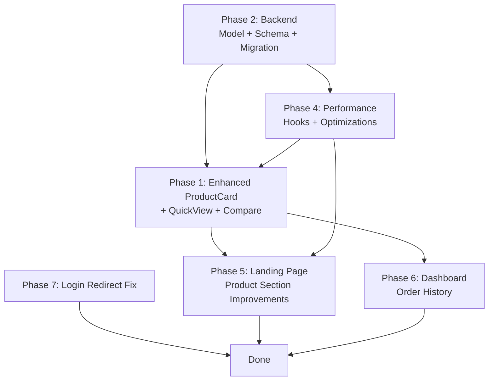

# E-Commerce App Enhancement Plan

Comprehensive plan to enhance the Product Card, add proper pagination, implement performance optimizations, improve the landing page product section, build a real order history dashboard, and fix the post-login redirect flow.

---

## Current State Analysis

After reviewing your codebase, here's what exists today:

| Feature | Status | Location |
|---|---|---|
| **ProductCard** | Basic — shows image, name, category, rating, price, wishlist, add-to-cart | [ProductCard.jsx](file:///d:/clone/em/frontend/src/components/ProductCard.jsx) |
| **Products Page** | Has offset pagination, filters, sort | [ProductsPage.jsx](file:///d:/clone/em/frontend/src/views/ProductsPage.jsx) |
| **Landing Page** | Has hero, categories, top-selling (8 hardcoded), recommended (4 hardcoded) | [LandingPage.jsx](file:///d:/clone/em/frontend/src/views/LandingPage.jsx) |
| **Dashboard** | Has profile, wishlist, settings tabs. Order history tab exists but is **empty placeholder** | [Dashboard.jsx](file:///d:/clone/em/frontend/src/views/Dashboard.jsx) |
| **Login redirect** | Sends user to `/dashboard` after login | [LoginPage.jsx](file:///d:/clone/em/frontend/src/views/LoginPage.jsx#L35) |
| **Backend Product model** | Has `discount_price`, `stock`, `sales_count`, `featured`, but **missing**: `secondary_image`, `shipping_badge`, `is_new`, `is_bestseller` | [product.py](file:///d:/clone/em/backend/app/models/product.py) |
| **Backend Order API** | Fully working with `GET /orders/me` endpoint | [order.py](file:///d:/clone/em/backend/app/api/v1/endpoints/order.py#L210) |

---

## Proposed Changes

### Phase 1 — Enhanced Product Card

> [!IMPORTANT]
> The ProductCard is the most visible component in the app. This is a high-impact UI change that touches multiple pages.

#### What the card currently shows vs. what it should show:

| Element | Current | Planned |
|---|---|---|
| Product Image | ✅ Single image | ✅ + Secondary image on hover |
| Wishlist Button | ✅ | ✅ Keep |
| Quick View | ❌ Missing | ✅ Add modal trigger |
| Compare Button | ❌ Missing | ✅ Add |
| Product Name | ✅ | ✅ Keep |
| Category | ✅ | ✅ Keep |
| Brand | ❌ Missing | ✅ Show below category |
| Rating | ✅ Stars | ✅ Keep |
| Review Count | ✅ | ✅ Keep |
| Price | ✅ Current price only | ✅ + Original price + Discount % |
| Stock Status | ❌ Missing | ✅ In Stock / Low Stock / Out of Stock badge |
| Shipping Badge | ❌ Missing | ✅ "Free Shipping" badge |
| New Badge | ❌ Missing | ✅ Based on `created_at` (< 7 days) |
| Sale Badge | ❌ Missing | ✅ When `discount_price < price` |
| Best Seller Badge | ❌ Missing | ✅ Based on `sales_count` threshold |
| Favorite Button | ✅ (Wishlist) | ✅ Keep |
| Add to Cart | ✅ | ✅ Keep |
| View Details | ❌ Missing | ✅ Add as secondary action |

#### Files to modify:

##### [MODIFY] [ProductCard.jsx](file:///d:/clone/em/frontend/src/components/ProductCard.jsx)
- Complete rewrite with all 18 elements listed above
- Secondary image shown on hover using CSS `opacity` toggle on `group-hover`
- Badges positioned absolutely at top-left (stacked: New, Sale, Best Seller)
- Stock status shown as a colored dot + text
- Original price with strikethrough + discount percentage in a badge
- Brand shown below category label
- Quick View button opens a modal (dispatches to a QuickView component)
- Compare button (checkbox-style toggle)
- "View Details" link alongside "Add to Cart"

##### [NEW] `frontend/src/components/QuickViewModal.jsx`
- Modal overlay showing product details without navigating
- Shows all images, full description, specs, price, add to cart
- Closes on backdrop click or ESC key

##### [NEW] `frontend/src/services/CompareContext.jsx`
- React Context for managing product comparison list (max 4 items)
- `addToCompare`, `removeFromCompare`, `isInCompare`, `compareItems`

##### [MODIFY] [Providers.jsx](file:///d:/clone/em/frontend/src/app/Providers.jsx)
- Wrap app with `CompareProvider`

---

### Phase 2 — Backend: Product Model Enhancements

##### [MODIFY] [product.py (model)](file:///d:/clone/em/backend/app/models/product.py)
- Add computed/virtual fields or new columns:
  - `review_count` (Integer, default 0) — denormalized count for fast reads
  - `free_shipping` (Boolean, default False)

##### [MODIFY] [product.py (schema)](file:///d:/clone/em/backend/app/schemas/product.py)
- Add to `ProductRead`:
  - `review_count: int`
  - `free_shipping: bool`
  - `sales_count: int` (already in model, just expose in schema)
- These will enable the frontend to show all badge/status info

##### [NEW] Alembic migration
- Add `review_count` and `free_shipping` columns to products table

---

### Phase 3 — Pagination Strategy (Explanation + Recommendation)

Here's a breakdown of all four pagination approaches for your understanding:

#### Offset Pagination (✅ Currently Used)
```
GET /products?page=2&limit=12 → OFFSET 12 LIMIT 12
```
- **How it works**: Skip N rows, take M rows using SQL `OFFSET`/`LIMIT`
- **Pros**: Simple, allows jumping to any page, shows total count
- **Cons**: Slow on very large datasets (DB must scan skipped rows), data can shift between pages on insert/delete
- **Best for**: Admin panels, product catalogs with < 100K items

#### Cursor Pagination
```
GET /products?after=eyJpZCI6MTAwfQ&limit=12
```
- **How it works**: Uses an opaque cursor (encoded last-seen ID/timestamp) instead of page numbers. DB uses `WHERE id > cursor LIMIT N`
- **Pros**: Consistently fast regardless of depth, no data skipping issues
- **Cons**: Cannot jump to arbitrary pages, more complex implementation
- **Best for**: Social feeds, real-time data, infinite scroll backends

#### Infinite Scroll
- **How it works**: Frontend detects when user scrolls near bottom → auto-fetches next page → appends to DOM
- **Pros**: Smooth UX, feels modern, great for browsing/discovery
- **Cons**: Hard to bookmark/share position, back-button loses position, accessibility issues, memory grows unbounded
- **Best for**: Social media feeds, image galleries

#### Load More Button
- **How it works**: Like infinite scroll but user-triggered — a "Load More" button appends next batch
- **Pros**: User controls data loading, preserves scroll position, simpler than infinite scroll
- **Cons**: Still can't jump to specific pages, cumulative memory use
- **Best for**: Blog posts, comments, moderate-size catalogs

#### 🏆 Recommendation for Your App

> [!TIP]
> **Keep Offset Pagination** for the Products Page (it already works well and allows direct page access). **Add a "Load More" button** to the Landing Page's top-selling section so users can progressively discover products without leaving the page.

##### No backend changes needed — your API already supports `page` + `limit`.

---

### Phase 4 — Performance Optimizations

Each technique explained with what we'll implement:

#### 1. Lazy Loading ✅
**What**: Defer loading of off-screen images and components until they're about to enter the viewport.
**Implementation**: Use Next.js `Image` component with `loading="lazy"` (default), add `IntersectionObserver` for below-fold sections.

#### 2. Image Optimization ✅
**What**: Serve correctly sized images in modern formats (WebP/AVIF) with responsive `srcset`.
**Implementation**: Already using Next.js `Image` in some places. Standardize all `` tags to use `<Image>` component across LandingPage and ProductsPage (currently using raw ``).

#### 3. Virtualization
**What**: Only render DOM nodes for visible items in a large list (react-window / react-virtualized).
**Best for**: Lists with 1000+ items. Your product grid has 12/page so virtualization adds complexity with minimal benefit.
**Decision**: ❌ Skip — offset pagination already limits DOM nodes.

#### 4. Caching ✅
**What**: Cache API responses in memory to avoid refetching on revisit.
**Implementation**: Add a simple in-memory cache layer in `api.js` with TTL (time-to-live). Cache `getProducts`, `getCategories`, `getProductFilters`.

#### 5. Debouncing ✅
**What**: Delay execution of rapidly-fired events (e.g., search input, price range input).
**Implementation**: Already needed — price range inputs in ProductsPage fire API calls on every keystroke. Add `useDebounce` hook.

#### 6. Memoization ✅
**What**: Cache expensive computations/renders to avoid re-execution.
**Implementation**: Wrap `ProductCard` in `React.memo()`, memoize filter computations, use `useMemo` for derived state.

#### 7. Code Splitting ✅
**What**: Load JavaScript on demand per route instead of one giant bundle.
**Implementation**: Next.js already does route-based code splitting. Add `dynamic()` imports for heavy components: QuickViewModal, CompareDrawer.

#### 8. Infinite Scroll
**Decision**: ❌ Skip for products page (offset pagination is better for e-commerce). Partially used via "Load More" on landing page.

#### 9. Prefetching ✅
**What**: Preload data/assets the user is likely to need next.
**Implementation**: Use Next.js `<Link prefetch>` for product detail pages. Prefetch next page of products on hover over "Next" pagination button.

#### 10. Database Indexes ✅
**What**: Add B-tree indexes on frequently queried/sorted columns.
**Implementation**: Add indexes on: `products.category`, `products.brand`, `products.price`, `products.sales_count`, `products.created_at`, `orders.user_id`, `orders.status`.

#### 11. Redis Caching
**What**: Server-side caching layer using Redis for frequently accessed data.
**Decision**: ❌ Defer — requires Redis infrastructure setup. The in-memory API cache + DB indexes will handle current scale.

#### Files to create/modify:

##### [NEW] `frontend/src/hooks/useDebounce.js`
- Generic debounce hook with configurable delay

##### [MODIFY] [ProductsPage.jsx](file:///d:/clone/em/frontend/src/views/ProductsPage.jsx)
- Debounce price range inputs
- Use `React.memo` on product cards
- Convert raw `` to Next.js `<Image>`

##### [MODIFY] [LandingPage.jsx](file:///d:/clone/em/frontend/src/views/LandingPage.jsx)
- Convert raw `` to Next.js `<Image>`
- Add lazy loading for below-fold sections

##### [NEW] Alembic migration for DB indexes

---

### Phase 5 — Landing Page Product Section Improvements

> [!IMPORTANT]
> The current landing page has two hardcoded product sections with no user control. We'll make them dynamic, manageable, and feature-rich.

#### Current Problems:
1. Top-selling shows exactly 8 products with no way to see more
2. Recommended shows 4 products — not actually personalized
3. No "View All" for top-selling section
4. Product cards in landing page are **different** from `ProductCard.jsx` (inline cards, not reusable)
5. Rating is hardcoded as "4.9" — not from real data

#### Planned Improvements:

##### [MODIFY] [LandingPage.jsx](file:///d:/clone/em/frontend/src/views/LandingPage.jsx)
- **Replace inline product cards** with the enhanced `<ProductCard />` component for consistency
- **Add "Load More" button** to top-selling section (loads 8 more products each click)
- **Fix hardcoded rating** — use `product.rating` from API
- **Add "Featured Products" section** — curated products where `featured: true`
- **Add "New Arrivals" section** — sorted by `created_at` desc
- **Add section navigation** — quick scroll links for each section
- **Improve Recommended section** — show 8 products in a 4-column grid (was 4 in horizontal cards)
- Convert all raw `` to Next.js `<Image>`

---

### Phase 6 — User Dashboard: Order History

> [!IMPORTANT]
> The order history tab in the dashboard is currently an **empty placeholder** showing "No orders yet" regardless of actual orders. The backend API (`GET /orders/me`) is already fully functional.

##### [MODIFY] [Dashboard.jsx](file:///d:/clone/em/frontend/src/views/Dashboard.jsx)
- Replace the empty placeholder in the `orders` tab with a full order history UI:
  - **Order status filter tabs**: All, Pending, Confirmed, Shipped, Delivered, Cancelled
  - **Order cards** showing:
    - Order ID and date
    - Status badge (color-coded)
    - Payment method and payment status
    - Item thumbnails (from `order.items` JSON)
    - Item names, quantities, prices
    - Total amount
    - Shipping address
    - "View Details" expand/collapse
    - "Track Order" timeline (visual progress: Pending → Confirmed → Shipped → Delivered)
  - **Empty state** when no orders match the selected filter
  - **Loading skeleton** while fetching
- Wire up to `api.getMyOrders(token, status)` which already exists

---

### Phase 7 — Post-Login Redirect to Landing Page

> [!NOTE]
> Currently, login redirects to `/dashboard`. The user wants it to go to the landing page (`/`) instead, so they can continue shopping. Dashboard should be accessible from the navbar/profile menu.

##### [MODIFY] [LoginPage.jsx](file:///d:/clone/em/frontend/src/views/LoginPage.jsx)
- Change `router.push('/dashboard')` → `router.push('/')` (line 35 and line 162)

##### [MODIFY] [SignupPage.jsx](file:///d:/clone/em/frontend/src/views/SignupPage.jsx)
- If it also redirects to `/dashboard`, change to `'/'`

---

## Open Questions

> [!IMPORTANT]
> **Product comparison feature scope**: Should the compare button open a side drawer or a separate `/compare` page? A side drawer is lighter-weight; a full page allows a detailed comparison table. I recommend a **side drawer** for now.

> [!IMPORTANT]
> **Quick View modal depth**: Should the Quick View modal include add-to-cart functionality, or should it just show product info and a "View Full Details" link? I recommend **full functionality** (add to cart + wishlist + view details link).

> [!IMPORTANT]
> **Database migration risk**: Adding new columns (`review_count`, `free_shipping`) and indexes requires a database migration. Are you comfortable running `alembic upgrade head`? This is non-destructive (adds columns with defaults).

> [!IMPORTANT]
> **"New" badge threshold**: I'll use `created_at` within last 7 days as the "New" criteria. Should this be a different duration?

> [!IMPORTANT]
> **"Best Seller" threshold**: I'll use `sales_count >= 10` as the criteria. Does this threshold make sense for your data?

---

## Task Execution Order



**Why this order**: Backend model changes provide the data the ProductCard needs. Performance hooks (debounce, memo) are used by multiple phases. The enhanced ProductCard is used by both landing page and products page. Login redirect is a one-line change done last.

---

## Verification Plan

### Automated Tests
```bash
# Backend: Run existing tests
cd backend && python -m pytest tests/ -v

# Frontend: Build check
cd frontend && npm run build
```

### Manual Verification
- [ ] ProductCard renders all 18 elements correctly on products page
- [ ] Secondary image swaps on hover
- [ ] Quick View modal opens and shows product details
- [ ] Compare button toggles and compare drawer shows selected items
- [ ] Badges (New, Sale, Best Seller) appear conditionally
- [ ] Stock status shows correct state (In Stock / Low Stock / Out of Stock)
- [ ] Discount percentage calculates correctly
- [ ] Landing page "Load More" button fetches and appends more products
- [ ] Landing page uses consistent ProductCard component
- [ ] Order history tab shows real orders from API
- [ ] Order status filter tabs work
- [ ] Order timeline visualization displays correctly
- [ ] Login redirects to landing page (`/`)
- [ ] Dashboard is still accessible from navbar profile menu
- [ ] Price range filter is debounced (no rapid API calls)
- [ ] All images use Next.js `<Image>` component
- [ ] No console errors or warnings
